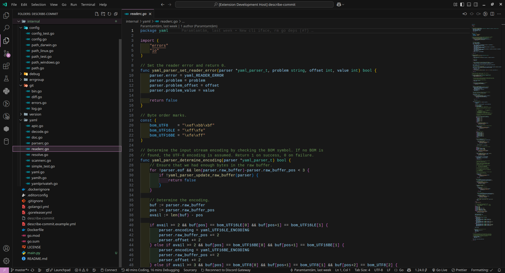

# kestral README

## Working with Markdown

You can author your README using Visual Studio Code. Here are some useful editor keyboard shortcuts:

* Split the editor (`Cmd+\` on macOS or `Ctrl+\` on Windows and Linux).
* Toggle preview (`Shift+Cmd+V` on macOS or `Shift+Ctrl+V` on Windows and Linux).
* Press `Ctrl+Space` (Windows, Linux, macOS) to see a list of Markdown snippets.

## For more information

* [Visual Studio Code's Markdown Support](http://code.visualstudio.com/docs/languages/markdown)
* [Markdown Syntax Reference](https://help.github.com/articles/markdown-basics/)

**Enjoy!**

## Information

This theme is based on the [Default Dark Modern](https://github.com/microsoft/vscode/tree/main/extensions/theme-defaults/themes) theme, with some modifications to the colors and styles.
